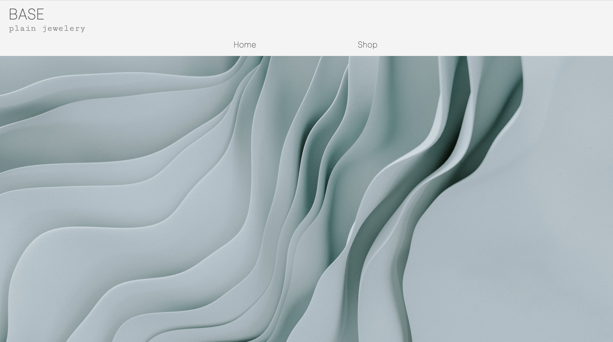

# Shopping Cart

This project is a part of the [Odin](https://www.theodinproject.com/paths/full-stack-javascript) course on ReactJS as a final [task](https://www.theodinproject.com/lessons/node-path-react-new-shopping-cart) for React Router topic.

Live version of the project can be found [here](https://mountaiflockshoppingcart.netlify.app/ShopPage). 


This is an online jewerly shop simulator which includes Home Page, Navigation panel, Shop page and Shopping cart. The productst of the shop are fetched from the [FreeAPI.com](https://fakestoreapi.com/docs). 

The products can be added to the cart in any quantity regulated manually or by increment/decrement buttons. They also can be deleted from the shopping cart one by one or the shopping cart can be emptied wholly.

The site is adaptive for mobile devices.

To run the project locally:

Clone this project:
```sh 
git clone git@github.com:mountainflock/shopping_cart.git
```

Install npm: 
```sh 
npm install
```

For project preview run:
```sh
npm run preview
```

Go to the local host in browser: 
```sh 
http://localhost:4173/
```

For the project build

```sh
npm run build
```

## Built with: 
* React + Vite
* Node.js
* CSS
* HTML 

## Display

